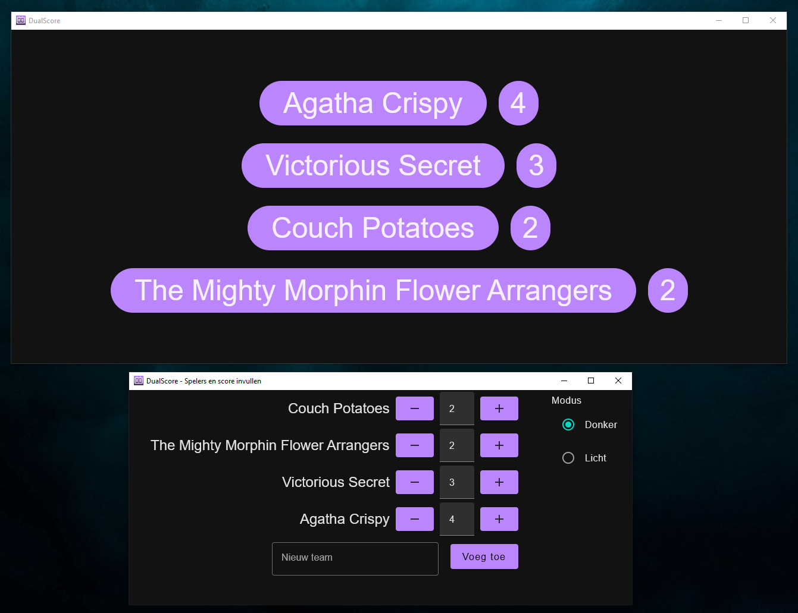

# DualScore
DualScore is a tool that allows you to project scores on a beamer while managing teams and scores on another screen. It's perfect for pub quizzes!

## Installing and running
To get started with DualScore, download the [latest release](https://github.com/Cristan/DualScore/releases/latest) and run the executable. Note that on Windows, no shortcut is made on your start menu, so you'll have to go to the installation directory to run it.

## Features
DualScore has the following features:

* Two screens, so you can show the scores on a beamer while you can edit them on another screen
* Fancy animation whenever a team overtakes another
* Dark mode: having a big white screen can mess up your mood lighting. Dark mode takes care of that :)

## Issues or bugs
If you encounter any issues or missing features while using DualScore, report it on the [issues](https://github.com/Cristan/DualScore/issues) tab.

## Contributing
DualScore is created via Compose on Desktop. PR's are welcome: fork it, create a branch, make an improvement and submit the PR.